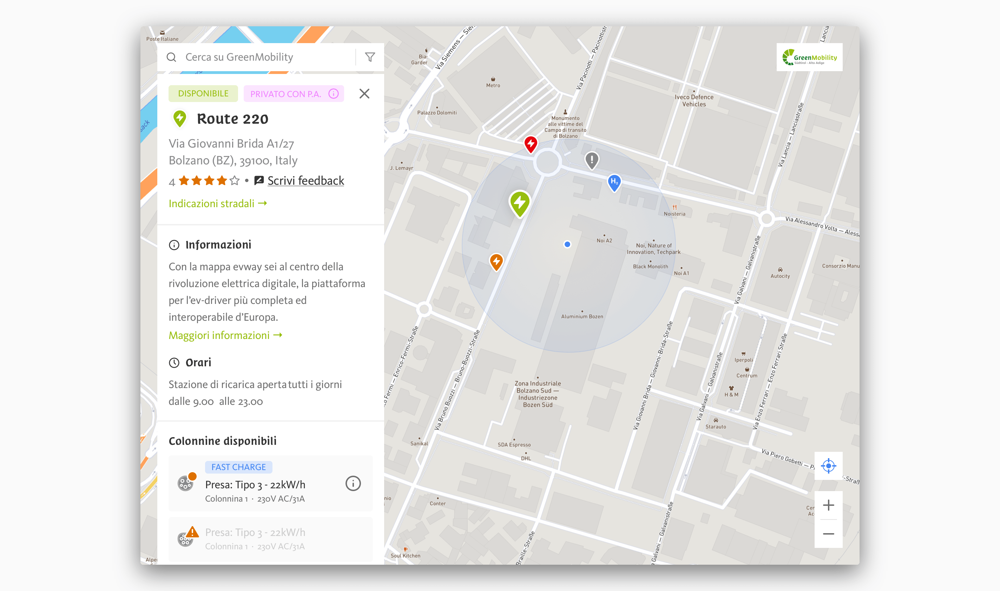

# Mobility E-Charging Map

This project contains the map web component for the [Green Mobility South Tyrol](https://www.greenmobility.bz.it/) project.

## Why

[Greenmobility](https://www.greenmobility.bz.it/it/) wants to split the existing functionalities of the website into reusable and independent components. Using these webcomponents, a developer can easily integrate the functionality of the single components into any website.
The data source for the components is the [Open Data Hub](https://opendatahub.bz.it/) project.

## Choices

To create more structured and mantainable webcomponents we used [Polymer](https://www.polymer-project.org/), more specifically the [lit-element](https://lit-element.polymer-project.org/) implementation.

Using [lerna](https://github.com/lerna/lerna) we can manage all the components from a single repository, while still being able to publish single packages

So the project can benefit of:

- a better project structure
- a better dependencies management
- a better way to pack up components
- and every component is isolated with its own dependencies

CSS styles are transpiled using [Sass](https://sass-lang.com/).

We are usign [Webpack](https://webpack.js.org/) to create the bundles.

## Getting Started

### Prerequisites

To work on the project, you'll need global installations of:

- Node (v11.9.0)
- Yarn (v1.15.2)
- Lerna (v3.6)

Later versions of the same tools should also work.

### Installing

A step by step series of examples that tell you how to get a development env running

Install yarn project's dependencies

```
yarn
```

To install all the dependencies of all the packages through Lerna, run:

```
lerna bootstrap
```


### Developement

Start the Lerna pipeline with:

```
yarn wc
```

This will watch the files in every package configured in the right way to create a Webpack bundle.

### Production

Build all widgets using Webpack's `production` config:

```
yarn bc
```

The destination for the resulting code will be the `dist` folder, located at the root of the project.

## Development results

To see the components in action while working on, go to the `work` folder and run:

```
sh serve.sh
```

This will serve the "work in progress" website at [http://0.0.0.0:8000/](http://0.0.0.0:8000/).

## Deployment

To deploy the webcomponents, take the production bundle created with the `yarn bc` command and use it as a normal javascrip script.

We suggest deploying them on a CDN, rather than hardcoding them inside a project, so that future fixes and enhancements of the webcomponents are more easily distributed.

## Running the tests

TODO

### Break down into end to end tests

TODO

### And coding style tests

TODO

## Contributing

TODO

## Screenshots



## Authors

- **Luca Fedrizzi** ([luca.fedrizzi@belkadigital.com](luca.fedrizzi@belkadigital.com)) - _Initial work_ - [fedriz](https://github.com/fedriz)

## License

TODO